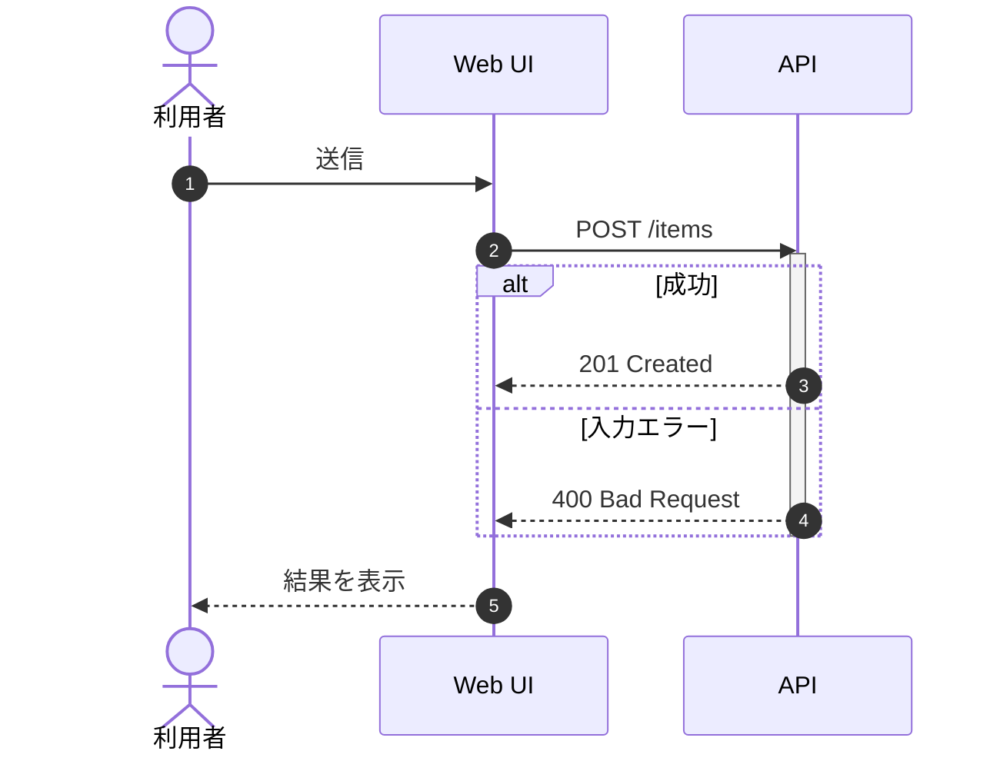

# KJ Board JSON specification (current app)

The source of truth for runtime behavior is the repository's `kj_board_app.py`, particularly JavaScript `migrateLegacyNote()` and `normalizeBoard()`. This document targets new files produced for that app.

## Root object

```json
{
  "title": "セッションタイトル",
  "notes": []
}
```

- `title`: UTF-8 string; appears in the canvas and PDF header.
- `notes`: ordered list of sticky note objects. The app can normalize a few missing legacy fields, but newly authored boards should include all recommended fields.
- **Do not** generate old `groups` / `edges`. Grouping and linking were intentionally removed.

## Recommended note object

```json
{
  "id": "n01_hello",
  "title": "何を学べる？",
  "text": "始める前に仕組みをつかむ",
  "type": "markdown",
  "markdownSource": "## まず全体像\n\nここに説明を書きます。",
  "inline": "## まず全体像\n\nここに説明を書きます。",
  "language": "",
  "imageUrl": "",
  "color": "#FFF2A8",
  "x": 90,
  "y": 165,
  "w": 220,
  "z": 0
}
```

`title` and `text` support `\n` line breaks; JSON source must escape line breaks inside strings. `text` is a short canvas teaser, and the rich source is shown only in the popup/PDF.

### Shared fields

| Field | Type | Required for new boards | Description |
| --- | --- | --- | --- |
| `id` | string | yes | Stable, unique identifier |
| `title` | string | yes | Brief canvas and popup heading, may contain newlines |
| `text` | string | yes | Canvas summary/notes; displayed in PDF index |
| `type` | enum | yes | `markdown`, `code`, `mermaid`, `image` |
| `color` | hex | yes | One of the supported pastel colors below |
| `x`, `y` | number | yes | Canvas coordinates in CSS pixels |
| `w` | number | yes | Width of note, normally `220` |
| `z` | number | yes | Layering order. Distinct integers, e.g., `0..n-1` |

### Type-specific fields

| Note type | Main field | Expected content |
| --- | --- | --- |
| `markdown` | `markdownSource` | Raw Markdown with headings, lists, blockquotes, tables, links, fences |
| `code` | `inline`, `language` | Source code and a highlight.js language identifier |
| `mermaid` | `inline` | Mermaid diagram source, e.g., `sequenceDiagram` |
| `image` | `imageUrl` | Valid `https://…` or `data:image/…` URI |

`inline` can be provided alongside `markdownSource` for backward compatibility; keep them identical. For non-Markdown notes, set `markdownSource` to `""`. For Mermaid, set `language` to `"mermaid"`; for image, set `inline` and `language` to empty strings.

### Color palette

| Name | Hex |
| --- | --- |
| Yellow | `#FFF2A8` |
| Green | `#DDF4D2` |
| Blue | `#DCEEFF` |
| Pink | `#F7DDF1` |
| Orange | `#FFE0C2` |
| Purple | `#E9E0FF` |

## Authoring for canvas, popup, and PDF

Canvas cards appear at `x`,`y` and may overlap if poorly placed. Layout guidance:

- Keep the board title above the notes (first row around `y=180` or lower).
- Use at least ~30px horizontal gaps between notes; use ~50px or more between rows when content is short. Cards auto-size vertically according to text length, so long summaries require more gap.
- Place narrative sequence from **top → bottom, within a row left → right**. The PDF index uses visual positions and a row-nearness heuristic. Avoid ambiguous near-overlapping rows.
- Use Z-order for overlaps, **not** reading sequence.
- Use `markdownSource` for the full explanation, not `text`; use tables only when comparison improves understanding.
- For image slides with a small image, the PDF keeps its intrinsic size; only oversized images are scaled down to fit A4. Avoid excessively large base64 payloads.
- Long or very wide Mermaid sequences may be shrunk in an A4 PDF. Break into focused diagrams.

## Mermaid sequence diagram example



Put that literal source (with JSON-escaped newlines) in a `mermaid` note's `inline` field. See the full [reference-board.json](reference-board.json) for other syntax constructs.

Official Mermaid syntax reference: https://mermaid.js.org/syntax/sequenceDiagram.html

## Validation

```bash
python skills/kj-board-authoring/scripts/validate_board.py \
  skills/kj-board-authoring/references/reference-board.json --strict
```

The validator checks supported types, core fields, IDs, JSON syntax, relevant type-specific sources, positions, palettes, and obsolete root fields. It does **not** render Mermaid or verify remote image availability; test those in the app.

## Migration from the attached original authoring skill

The original `kj-session-board-json-authoring` skill described the earlier
`{title, notes, groups, edges}` model. In **kj-board-authoring**:

- Root `groups` and `edges` are **not generated**; spatial note clusters express affinity instead.
- Note `type` remains restricted to `markdown | code | mermaid | image` (no `text` note type).
- Original Markdown `inline` sources are preserved, and copied to `markdownSource`.
- The original fixed note height `h` is omitted; current note height grows to fit its content.
- `z` is included as the Z-order value; it is **not** the PDF index reading order.
- The original reference board's four groups were converted into four visually separated rows with three notes per row, without losing the original explanation and source text.

See [`authoring-guidelines.md`](authoring-guidelines.md) for the original skill's
three-layer writing and layout principles adapted to the current application.
