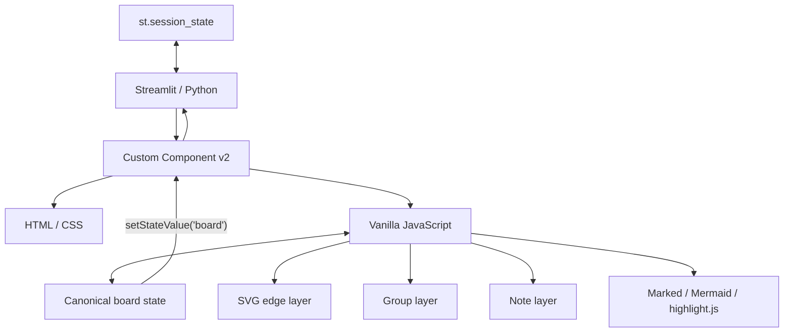

# DESIGN.md — KJ Session Board 設計仕様

## 1. プロダクト概要

KJ Session Board は、KJ法・アイデア整理・技術解説・プレゼンテーションに利用する Streamlit アプリケーションである。

中心となる体験は次の3段階。

```text
発散        →        構造化        →        説明
付箋作成             グループ化             表示モード
自由配置             関係線                 rich popup
```

一般的な Streamlit widget だけでは自由配置・矩形選択・SVG接続線の実装が難しいため、Canvas 部分を Custom Components v2 で構築する。

---

## 2. アーキテクチャ



### Python の責務

- Streamlit ページ設定
- Component v2 登録
- component state の受け取り
- Session State へのボード保存
- 操作ガイド等の Streamlit UI

### JavaScript の責務

- ボード内部状態
- ドラッグ
- 矩形選択
- nested group 計算
- SVG接続線
- modal
- Undo / Redo
- JSON import / export
- edit/view mode
- fullscreen
- rich content rendering

---

## 3. ファイル構成

```text
app.py
requirements.txt
AGENT.md
DESIGN.md
SKILL.md
reference_board.json
```

`app.py` の論理構造:

```text
Python
├── EMPTY_BOARD
├── HTML
├── CSS
├── JS
├── st.components.v2.component(...)
├── get_component_board(...)
└── Streamlit page
```

フロントエンドを別ビルドへ分離しないことで、教材・PoC・単体配布の容易さを優先する。

---

## 4. Canonical Board JSON

参照実体: [`reference_board.json`](./reference_board.json)

トップレベル:

```json
{
  "title": "string",
  "notes": [],
  "groups": [],
  "edges": []
}
```

### 4.1 Note

```json
{
  "id": "note_xxx",
  "title": "付箋タイトル",
  "text": "ボード上に表示する短い要約",
  "type": "text",
  "inline": "",
  "language": "python",
  "imageUrl": "",
  "color": "#FFF2A8",
  "x": 100,
  "y": 200,
  "w": 210,
  "h": 150
}
```

#### type

| type | `text` | `inline` | `language` | `imageUrl` | 表示モード popup |
|---|---|---|---|---|---|
| `text` | 本文 | 未使用 | 未使用 | 未使用 | テキスト |
| `code` | 要約 | コード | 言語 | 未使用 | syntax highlight |
| `markdown` | 要約 | Markdown | `markdown` | 未使用 | HTML render |
| `mermaid` | 要約 | Mermaid | `mermaid` | 未使用 | SVG diagram |
| `image` | 要約 | 未使用 | 未使用 | URL | 画像 |

現行サイズ:

```javascript
NOTE_W = 210
NOTE_H = 150
```

付箋サイズは JSON にも保存するため、将来リサイズを追加しやすい。

### 4.2 Group

```json
{
  "id": "group_xxx",
  "name": "グループ名",
  "noteIds": ["note_1"],
  "childGroupIds": ["group_child"]
}
```

`noteIds` はそのグループが **直接所有する付箋**。

`childGroupIds` は nested group。

グループ矩形そのものの座標は保存しない。

### 4.3 Edge

```json
{
  "id": "edge_xxx",
  "source": "group_a",
  "target": "group_b",
  "label": "関係名",
  "direction": "right"
}
```

`direction`:

| 値 | 表示 |
|---|---|
| `none` | 矢印なし |
| `right` | source → target |
| `left` | source ← target |

---

## 5. normalizeBoard

外部 JSON は直接 state へ入れず、必ず `normalizeBoard()` を通す。

責務:

- null / 欠損を default 化
- note の type / dimensions / rich fields を補完
- group ID を検証
- self child を除外
- 存在しない group を child から除外
- edge direction を正規化
- 存在しない group への edge を除外
- source == target の edge を除外
- 過去の `details[]` 形式から一部互換変換

新しい schema field を追加する場合は、まず `normalizeBoard()` に default を実装する。

---

## 6. State synchronization

### Component 初期化

```text
Python current_board
  ↓
component(data={"board": current_board})
  ↓
JavaScript normalizeBoard(...)
  ↓
app.board
```

### 操作後

```text
user action
  ↓
snapshot()
  ↓
app.board を変更
  ↓
render()
  ↓
sync()
  ↓
setStateValue("board", payload)
  ↓
Streamlit component state
  ↓
st.session_state.board_seed
```

`lastSyncedSerialized` は、自分が送信した state が Streamlit から戻った際の不要な再初期化を避けるために使う。

---

## 7. Undo / Redo

変更前に:

```javascript
snapshot()
```

を呼ぶ。

```text
history <= previous board
future  = []
```

Undo:

```text
future <= current
current = history.pop()
```

Redo:

```text
history <= current
current = future.pop()
```

履歴上限は現行 70。

ドラッグは開始時に1回 snapshot し、pointermove ごとに履歴を増やさない。

---

## 8. Edit mode / View mode

### Edit mode

可能:

- add / delete note
- drag note
- text direct edit
- rich modal edit
- group
- group rename / delete
- connect
- edge edit / delete
- undo / redo
- title edit

### View mode

編集UIを CSS で隠し、イベント側でも edit check を行う。

`display:none` だけに依存してはいけない。

例:

```javascript
if (this.viewMode !== "edit") return;
```

表示モードの rich note:

```text
double click
  ↓
openNoteModal()
  ↓
renderDisplayPreview()
```

---

## 9. 付箋削除イベント

削除ボタンは `.note-handle` 内部に配置される。

ドラッグとのイベント競合を避けるため次を維持する。

```javascript
del.addEventListener("pointerdown", evt => {
  evt.stopPropagation();
});

del.addEventListener("click", evt => {
  evt.preventDefault();
  evt.stopPropagation();
  evt.stopImmediatePropagation();
  deleteNote(note.id);
});
```

ドラッグ開始側:

```javascript
if (evt.target.closest(".note-delete")) return;
```

これは既知の重要な回帰防止ポイント。

---

## 10. Group geometry

定数:

```javascript
GROUP_PAD = {
  left: 30,
  right: 30,
  top: 52,
  bottom: 30
};

GROUP_MIN_W = 190;
GROUP_MIN_H = 120;
```

`top: 52` はグループタイトルを矩形左上内側へ確保する意味も持つ。

### Bounds 再帰計算

グループ `G` の対象矩形集合:

```text
R(G) =
  bounds(direct notes)
  +
  bounds(child groups)
```

子グループは再帰的に計算する。

```text
minX = min(rect.x)
minY = min(rect.y)
maxX = max(rect.x + rect.w)
maxY = max(rect.y + rect.h)

x = minX - leftPad
y = minY - topPad

w = max(
  GROUP_MIN_W,
  maxX - minX + leftPad + rightPad
)

h = max(
  GROUP_MIN_H,
  maxY - minY + topPad + bottomPad
)
```

この方式により、親グループは:

- 子の点線矩形
- 子タイトル領域
- 子外周余白

を含んだ上で、さらに自身の余白を持つ。

### Cycle protection

`groupBoundsById(groupId, stack)` は再帰 stack を持ち、cycle が発生しても無限再帰しない。

ただし canonical model として cycle を作らないことが原則。

---

## 11. Grouping interaction

矩形選択時:

### Existing groups

グループは **矩形全体が selection 内に入った場合**選択する。

selected group の親も同時に選択されている場合、top-level selected group だけを採用する。

### Notes

付箋は現行実装では **中心点**が selection 内にあるかで選択する。

### Nested group 作成

selection 全体が既存 group 内に入っている場合:

1. container candidate を検索
2. 最も深い group を parent とする
3. parent が直接所有する selected note を新 child group へ移動
4. selected child groups を新 group へ re-parent
5. 新 group ID を parent.childGroupIds へ追加

これにより、partial sibling group の note を誤って抜き取らない。

---

## 12. Edge geometry

要件:

> グループの中心同士を結ぶ方向は維持するが、線自体はグループ矩形境界で止める。

source rect:

```text
A = (ax, ay, aw, ah, acx, acy)
```

target center:

```text
Bcenter = (bcx, bcy)
```

方向ベクトル:

```text
dx = bcx - acx
dy = bcy - acy
```

source half size:

```text
halfW = aw / 2
halfH = ah / 2
```

intersection scale:

```text
scaleX = halfW / abs(dx)
scaleY = halfH / abs(dy)
scale  = min(scaleX, scaleY)
```

boundary:

```text
x = acx + dx * scale
y = acy + dy * scale
```

target 側も逆向きに同じ計算をする。

ラベルは実際の start/end の中点へ配置する。

---

## 13. Rich note rendering

### code

CDN:

```text
highlight.js@11.11.1
```

編集モード:

- title
- summary
- color
- language
- source code

表示モード:

```html
<pre><code class="hljs language-...">...</code></pre>
```

主要言語:

- Python
- Bash
- PowerShell
- JavaScript
- TypeScript
- JSON
- YAML
- SQL
- Java
- C#
- Go
- Rust
- HCL/Terraform
- Dockerfile
- Plain text

### markdown

CDN:

```text
marked@16
```

表示モードでは `inline` のソース自体を見せず、render result のみ。

### mermaid

CDN:

```text
mermaid@11
```

表示モードでは SVG のみ。

`securityLevel: "strict"` を維持する。

### image

`imageUrl` を `` へ設定。

編集モードでは URL 入力時に preview。

---

## 14. Fullscreen

fullscreen 対象は `board-viewport` ではなく **`.kj-app` 全体**。

理由:

modal は `.kj-app` の子要素であり、root 全体を fullscreen subtree に入れないと fullscreen 中に modal が画面外になる。

```javascript
await root.requestFullscreen();
```

CSS:

```css
.kj-app:fullscreen .modal-shell.open {
  z-index: 2147483646;
}
```

これにより全画面表示でも rich note popup が使える。

---

## 15. JSON Import / Export

### Export

```javascript
JSON.stringify(this.board, null, 2)
```

を Blob 化し download。

ファイル名:

```text
kj-board-YYYYMMDD-HHMMSS.json
```

### Import

最低限:

```text
notes  : array
groups : array
edges  : array
```

を確認する。

その後:

```text
snapshot
close modal
clear connection selection
normalizeBoard
render
sync
```

Import 前に confirmation を出す。

Import 直前 state は Undo 可能。

---

## 16. Session title

`board.title` が canonical state。

Edit:

- input
- blur または Enter で commit
- commit 前に snapshot

View:

- large title text
- 空文字なら `KJ Session`

JSON round trip の対象。

---

## 17. Canvas layout

標準初期値:

```text
CSS canvas:
1900 x 1200

dynamic minimum in JS:
1500 x 900
```

note/group が右下へ移動した場合は `resizeCanvas()` が最大座標を見て拡張する。

付箋新規作成は session title と重なりにくいよう、Y座標を上部から一定量空ける。

---

## 18. 6色 palette

canonical value:

| 名前 | HEX |
|---|---|
| イエロー | `#FFF2A8` |
| グリーン | `#DDF4D2` |
| ブルー | `#DCEEFF` |
| ピンク | `#F7DDF1` |
| オレンジ | `#FFE0C2` |
| パープル | `#E9E0FF` |

JSONでは色名ではなく HEX を保存する。

---

## 19. Reference board

[`reference_board.json`](./reference_board.json) は schema と UI の smoke fixture。

期待:

```text
2 groups
4 notes
1 edge
```

含む note types:

```text
text
code
markdown
mermaid
```

期待レイアウト:

```text
┌ ① Create ─────────────┐      ┌ ② Present ─────────────┐
│ [Idea]      [Code]    │ ───> │ [Markdown] [Mermaid]   │
└───────────────────────┘      └────────────────────────┘
```

画像付箋は remote URL 依存を避けるため fixture には含めない。

---

## 20. Security / trust boundary

現在の JSON Import はローカルファイルを読み込む。

注意点:

- JSONを信頼済みデータと仮定しない
- `escapeHtml()` を bypass しない
- code は highlight 前後で HTML 注入を起こさない
- Mermaid は strict mode を維持
- image は外部 URL を読み込むため、remote tracking / availability を考慮
- Markdown の HTML 許可範囲を変更する場合は XSS リスクを再評価する

特に不特定ユーザーから JSON を受け取るプロダクトへ拡張する場合は、Markdown HTML の sanitization を設計へ追加する。

---

## 21. 将来拡張の境界

現在は単一ブラウザ Session のアプリ。

共同編集を追加する場合、DOM synchronization を拡張するのではなく canonical board state を外部永続化する。

推奨方向:

```text
room_id
revision
PostgreSQL / Redis
WebSocket / SSE
optimistic concurrency
presence / cursor
facilitator role
```

ただしこれらは現行 MVP の必須要件ではない。
