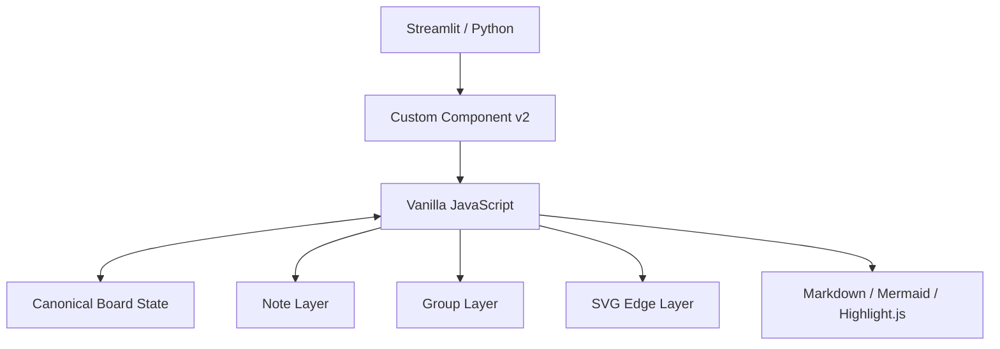
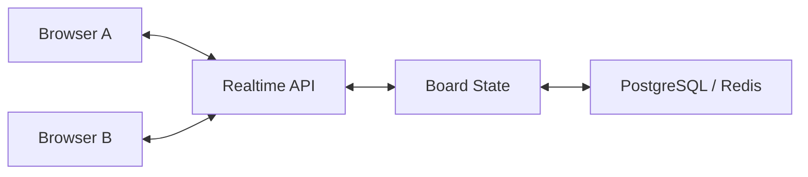

# KJ Session Board

Streamlit で動作する、KJ法・アイデア整理・技術解説・プレゼンテーション向けのインタラクティブなボードアプリケーションです。

付箋を自由に配置し、矩形選択でグループ化し、グループ同士を接続線で関連付けられます。  
さらに `code` / `markdown` / `mermaid` / `image` の rich 付箋を使うことで、単なるアイデア整理だけでなく、**技術解説・アーキテクチャ説明・教材・プレゼンテーション**にも利用できます。

---

## Features

### 付箋

- マウスドラッグによる自由配置
- 付箋の削除
- 6色のプリセットカラー
- 付箋タイプ:
  - `text`
  - `code`
  - `markdown`
  - `mermaid`
  - `image`

### Rich Note

`code` / `markdown` / `mermaid` / `image` の付箋は、ダブルクリックすると前景ポップアップで詳細を表示できます。

#### code

- 編集モードでソースコードを編集
- プログラミング言語を選択可能
- 表示モードでは syntax highlight 付きで表示

主な対応言語:

- Python
- Bash
- PowerShell
- JavaScript
- TypeScript
- JSON
- YAML
- SQL
- Java
- C#
- Go
- Rust
- HCL / Terraform
- Dockerfile
- Plain text

#### markdown

- 編集モードで Markdown ソースを編集
- 表示モードでは Markdown ソースを隠し、レンダリング結果のみ表示

#### mermaid

- 編集モードで Mermaid ソースを編集
- 表示モードでは Mermaid コードを隠し、図のみ表示

#### image

- 編集モードで画像 URL を設定
- 表示モードでは画像を表示

---

## Grouping

複数の付箋を矩形で囲んでグループ化できます。

```text
┌ Group A ─────────────────────────┐
│                                  │
│   [付箋]        [付箋]           │
│                                  │
└──────────────────────────────────┘
```

### Nested Groups

グループ内にさらにグループを作成できます。

```text
┌ Group A ────────────────────────────┐
│                                     │
│   [付箋]                            │
│                                     │
│      ┌ Group B ────────────────┐    │
│      │                          │    │
│      │  [付箋]      [付箋]     │    │
│      │                          │    │
│      └──────────────────────────┘    │
│                                     │
└─────────────────────────────────────┘
```

親グループの矩形サイズは、子グループの矩形・タイトル・余白を含むよう自動的に拡張されます。

---

## Relationships

グループ同士を接続線で結び、関係名を付けられます。

接続線のタイプ:

| Type | 表示 |
|---|---|
| `none` | 矢印なし |
| `right` | Source → Target |
| `left` | Source ← Target |

接続線はグループ中心間の方向を基準としながら、実際の線端はグループ矩形の境界へ接続されます。

```text
┌ Group A ───────┐        ┌ Group B ───────┐
│                │ ─────→ │                │
│    [付箋]      │ 関係名 │    [付箋]      │
│                │        │                │
└────────────────┘        └────────────────┘
```

---

## Edit Mode / View Mode

KJ Session Board には2つのモードがあります。

### Edit Mode

ボードを編集するモードです。

- 付箋作成
- 付箋移動
- 付箋削除
- rich 付箋編集
- グループ化
- nested group 作成
- グループ名変更
- 接続線作成
- Undo / Redo
- セッションタイトル編集

### View Mode

プレゼンテーション向けの表示専用モードです。

- 編集UIを非表示
- 付箋の誤操作を防止
- rich 付箋をダブルクリックして内容表示
- 全画面表示に対応
- 全画面表示中でも rich 付箋のポップアップを利用可能

技術解説やデモでは、**Edit Mode で構成を作り、View Mode で説明する**使い方を想定しています。

---

## Session Title

ボード左上にセッションタイトルを設定できます。

```text
Streamlit の紹介

┌ Group A ────────┐
│                  │
│     [付箋]       │
│                  │
└──────────────────┘
```

タイトルは JSON エクスポートにも含まれます。

---

## JSON Import / Export

ボードの状態は JSON として保存・復元できます。

保存対象:

- セッションタイトル
- 付箋
- 付箋タイプ
- rich content
- 付箋位置
- 付箋色
- グループ
- nested group
- 接続線
- 接続線ラベル
- 矢印方向

### Canonical JSON Model

```json
{
  "title": "KJ Session",
  "notes": [],
  "groups": [],
  "edges": []
}
```

### Note

```json
{
  "id": "note_xxx",
  "title": "Example",
  "text": "短い要点",
  "type": "code",
  "inline": "print('hello')",
  "language": "python",
  "imageUrl": "",
  "color": "#FFF2A8",
  "x": 100,
  "y": 200,
  "w": 210,
  "h": 150
}
```

### Group

```json
{
  "id": "group_xxx",
  "name": "Group A",
  "noteIds": [
    "note_xxx"
  ],
  "childGroupIds": []
}
```

### Edge

```json
{
  "id": "edge_xxx",
  "source": "group_a",
  "target": "group_b",
  "label": "related to",
  "direction": "right"
}
```

---

## Reference Board

リポジトリには JSON Import の動作確認に利用できる `reference_board.json` を含めます。

構成:

```text
2 Groups
4 Notes
1 Edge
```

付箋タイプ:

```text
text
code
markdown
mermaid
```

イメージ:

```text
┌ ① Create ─────────────┐       ┌ ② Present ────────────┐
│                       │       │                       │
│ [Idea]      [Code]    │ ───→  │ [Markdown] [Mermaid]  │
│                       │       │                       │
└───────────────────────┘       └───────────────────────┘
```

アプリ起動後に `reference_board.json` を読み込むことで、主要機能をすぐ確認できます。

---

## Architecture

KJ Session Board は、Streamlit と Custom Components v2 を組み合わせて実装しています。



### Python

Python / Streamlit 側は主に以下を担当します。

- Streamlit ページ
- Custom Component 登録
- Session State
- Component state の受信

### JavaScript

Canvas UI は Vanilla JavaScript で実装しています。

- Pointer Events
- Drag & Drop
- 矩形選択
- nested group の再帰計算
- SVG connection
- modal
- JSON import / export
- Undo / Redo
- Edit / View Mode
- Fullscreen
- rich content rendering

---

## Why Custom Components v2?

Streamlit 標準 widget はフォーム・データ表示・チャート・ダッシュボード構築には非常に強力ですが、KJ Session Board が必要とする以下の操作はブラウザ側での細かなイベント制御が必要です。

- 自由配置
- Pointer Event
- ドラッグ
- 矩形範囲選択
- SVG 接続線
- modal
- fullscreen
- rich content preview

そのため、このプロジェクトでは **Streamlit をアプリケーションランタイムとして使いながら、ボード部分だけを Custom Components v2 で拡張する**構成を採用しています。

---

## Requirements

- Python 3.10+
- Streamlit 1.64+

`requirements.txt`:

```text
streamlit>=1.64,<2
```

ブラウザ側では以下を CDN 経由で利用します。

- Marked 16
- Mermaid 11
- highlight.js 11.11.1

---

## Quick Start

### 1. Clone

```bash
git clone https://github.com/<YOUR_ACCOUNT>/<YOUR_REPOSITORY>.git
cd <YOUR_REPOSITORY>
```

### 2. Create virtual environment

Linux / macOS:

```bash
python -m venv .venv
source .venv/bin/activate
```

Windows PowerShell:

```powershell
python -m venv .venv
.venv\Scripts\Activate.ps1
```

### 3. Install

```bash
pip install -r requirements.txt
```

### 4. Run

```bash
streamlit run app.py
```

ブラウザで Streamlit アプリが開きます。

---

## Basic Workflow

### 1. 付箋を作る

```text
Type     : text
Color    : Yellow
Content  : アイデア
```

`＋ 付箋` をクリックします。

### 2. 移動する

`移動` モードで付箋上部をドラッグします。

### 3. グループ化する

`グループ化` を選択し、複数の付箋を矩形で囲みます。

### 4. 関係を作る

`グループ接続` を選択し、2つのグループを順番に選択します。

### 5. rich content を使う

`code` / `markdown` / `mermaid` / `image` の付箋を作成し、ダブルクリックして詳細を編集します。

### 6. プレゼンする

`表示モード` に切り替え、必要なら全画面表示にします。

---

## Example Use Cases

### KJ Method

アイデア発散 → グルーピング → 関係整理。

### Technology Explanation

```text
Concept
  ↓
Code example
  ↓
Architecture
  ↓
Mermaid diagram
```

付箋をダブルクリックしながら段階的に説明できます。

### Architecture Review

- component
- dependency
- responsibility
- data flow

をグループと接続線で表現できます。

### Infrastructure Documentation

例えば以下の説明ボードを作成できます。

- Linux troubleshooting
- PostgreSQL / psql
- AWS architecture
- Kubernetes
- Terraform
- CI/CD pipeline
- Automation workflow

### AI / LLM Education

- Prompt
- RAG
- Tool Calling
- Agent
- Workflow
- Model interaction

などを Mermaid とコード付きで説明できます。

---

## Development Documentation

AI エージェントや新しい開発者がプロジェクトを継続開発できるよう、開発ドキュメントを用意しています。

### `AGENT.md`

AI エージェントが守るべき作業契約。

含まれる内容:

- 維持すべき機能
- JSON互換性
- 既知の回帰ポイント
- 必須テスト
- 完了条件

### `DESIGN.md`

システム設計仕様。

含まれる内容:

- canonical JSON schema
- state synchronization
- nested group algorithm
- edge geometry
- edit / view mode
- fullscreen
- rich note rendering

### `SKILL.md`

変更作業の実装手順。

含まれる内容:

- data-model change recipe
- pointer-event safety
- group geometry change
- edge change
- JSON compatibility
- static verification
- browser acceptance sequence

開発を行う AI エージェントは、次の順に読むことを推奨します。

```text
AGENT.md
   ↓
DESIGN.md
   ↓
SKILL.md
   ↓
reference_board.json
   ↓
app.py
```

---

## Important Implementation Details

### Note deletion

付箋の削除ボタンはドラッグハンドル内部にあるため、Pointer Event の伝播を明示的に止めています。

この処理を削除すると、

```text
× をクリック
   ↓
drag handler が先に発火
   ↓
削除されない
```

という回帰が起こる可能性があります。

### Nested Group Bounds

グループ矩形の座標は JSON に保存しません。

毎回:

```text
direct notes
+
child group bounds
```

から再帰的に計算します。

### Edge Geometry

グループ間の線は:

```text
center A → center B
```

のベクトルを使いますが、描画位置は:

```text
group A boundary → group B boundary
```

となります。

これにより矩形中央まで線が入り込まず、視認性を保てます。

---

## Security Notes

### Mermaid

Mermaid は:

```javascript
securityLevel: "strict"
```

で動作させます。

### Markdown

不特定ユーザーがアップロードした JSON を公開サービスで扱う場合は、Markdown の HTML sanitization を追加することを推奨します。

### Image URL

`image` 付箋では外部 URL をブラウザから読み込みます。

そのため以下に注意してください。

- URL の信頼性
- remote tracking
- mixed content
- CORS
- URL expiration

---

## Current Scope

現在の KJ Session Board は **単一ブラウザセッション向け**です。

複数ユーザーのリアルタイム共同編集は現在のスコープ外です。

将来的に共同編集を実装する場合は、canonical board state を外部ストレージへ移す構成を推奨します。



候補:

- `room_id`
- revision
- optimistic concurrency
- WebSocket / SSE
- PostgreSQL / Redis
- presence
- participant cursor
- facilitator role

---

## Repository Structure

```text
.
├── app.py
├── requirements.txt
├── README.md
├── AGENT.md
├── DESIGN.md
├── SKILL.md
└── reference_board.json
```

---

## Verification

最低限、変更後に以下を確認してください。

### Python

```bash
python -m py_compile app.py
```

### Application

```bash
streamlit run app.py
```

### Reference Board

`reference_board.json` を読み込み、次を確認します。

```text
付箋      : 4
グループ  : 2
接続線    : 1
```

さらに:

- 付箋をドラッグできる
- ×で付箋を削除できる
- nested group を作成できる
- edge が矩形境界へ接続される
- rich popup が表示される
- View Mode で編集できない
- fullscreen 中でも rich popup が表示される
- JSON Export → Import で状態が復元される

詳細は [`AGENT.md`](./AGENT.md) と [`SKILL.md`](./SKILL.md) を参照してください。

---

## Development Philosophy

KJ Session Board は、巨大なホワイトボード製品を目指すプロジェクトではありません。

重視するのは、

> **構造化されたアイデアを、Python / Streamlit で素早く作成し、そのままインタラクティブに説明できること**

です。

そのため、実装上も次を優先します。

- 小さな依存関係
- JSONによる可搬性
- シンプルな状態モデル
- プレゼンテーションとの親和性
- 技術教材への転用性
- AI エージェントによる保守可能性

---

## License

公開時にプロジェクト方針に合ったライセンスを設定してください。

例:

```text
MIT License
Apache License 2.0
```

ライセンスを決定したら、このセクションを実際のライセンス名へ更新し、リポジトリ直下へ `LICENSE` ファイルを追加してください。

---

## Contributing

Issue / Pull Request を歓迎する場合は、以下の流れを推奨します。

1. Issue で変更目的を明確化
2. `AGENT.md` / `DESIGN.md` を確認
3. `reference_board.json` で互換性確認
4. 実装
5. `SKILL.md` の acceptance sequence を実施
6. Pull Request

特に JSON schema を変更する Pull Request では、後方互換性への影響を明記してください。

---

## Acknowledgements

KJ Session Board は以下の技術を利用しています。

- [Streamlit](https://streamlit.io/)
- [Mermaid](https://mermaid.js.org/)
- [Marked](https://marked.js.org/)
- [highlight.js](https://highlightjs.org/)

---

## Status

KJ Session Board は現在、機能検証と技術教材・プレゼン用途を中心に継続開発中です。

フィードバックや改善案は Issue として管理することを推奨します。
